<div align="center">


<h1>Application Security Baseline</h1>

<p><strong>Enterprise DevSecOps Platform: Secure by Design, Default, Pipeline, and Runtime</strong></p>

[](https://devopstrio.co.uk/)
[](/terraform)
[](/apps/compliance-engine)
[](https://devopstrio.co.uk/)

</div>

---

## 🏛️ Executive Summary


The **Application Security Baseline (ASB)** platform is the definitive system for enforcing security across the entire Software Development Life Cycle (SDLC). It transitions security from a reactive "gate" at the end of development into an automated, continuous mesh of preventative guardrails and runtime observability.

### Strategic Business Outcomes
- **Policy as Code (PaC)**: Blocks the deployment of infrastructure or apps lacking mandatory TLS, Private Endpoints, or WAF associations.
- **Automated Compliance**: Maps technical findings directly to high-level compliance frameworks (SOC2, ISO27001, OWASP ASVS).
- **Secrets Management**: Eradicates source code secrets via continuous scanning and automated Azure Key Vault injection mechanisms.
- **Runtime Anomaly Defense**: Ingests WAF signals and container telemetry to identify privilege escalation and Zero-Day exploitation attempts in production.

---

## 🏗️ Technical Architecture Details

### 1. High-Level Architecture
```mermaid
graph TD
    Dev[Developer Commit] --> Git[GitHub Repository]
    Git --> Actions[CI/CD Pipelines]
    Actions --> Scan[Scan Engine (SAST/DAST)]
    Scan --> Policy[Policy Engine (OPA)]
    Policy -->|Pass| AKS[Production AKS]
    Policy -->|Fail| Block[Pipeline Blocked]
    AKS --> Runtime[Runtime Security Engine]
    Scan --> Dash[Executive Dashboard]
    Runtime --> Dash
```

### 2. Secure SDLC Workflow
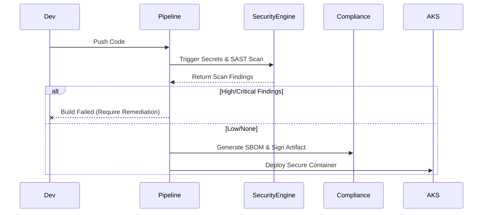

### 3. Scan Engine Pipeline Flow
```mermaid
graph LR
    Code[Source Code] --> Secret[Secrets Scan (TruffleHog)]
    Code --> SAST[Static Analysis (Sonar)]
    Code --> Dep[Dependency Scan (Snyk/Trivy)]
    Code --> IaC[IaC Scan (Checkov)]
    Secret --> Aggregator[Findings Normalization]
    SAST --> Aggregator
    Dep --> Aggregator
    IaC --> Aggregator
    Aggregator --> DB[(PostgreSQL)]
```

### 4. Secrets Management Lifecycle
```mermaid
graph TD
    Dev[Developer] --> CLI[Local Config (No Secrets)]
    App[Application Pod] --> WorkloadID[Azure Workload Identity]
    WorkloadID --> KV[Azure Key Vault]
    KV --> Engine[Secrets Engine]
    Engine -->|Rotation Schedule| KV
    App -->|Fetch at Runtime| DB[(Database)]
```

### 5. Compliance Evidence Collection
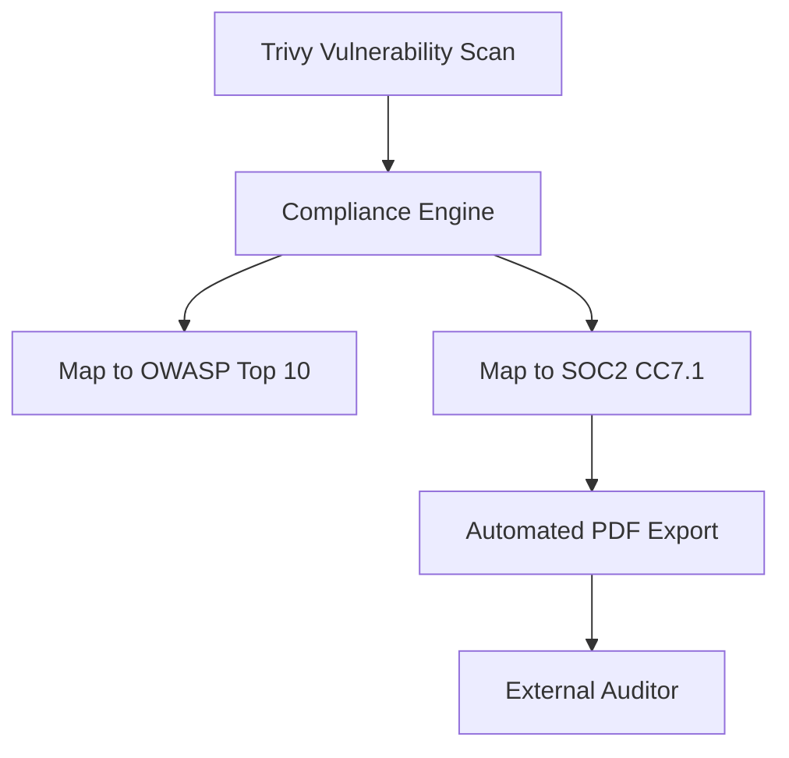

### 6. Security Trust Boundary
```mermaid
graph TD
    Internet --> WAF[Azure Web Application Firewall]
    WAF --> VNet[Private Virtual Network]
    VNet --> AKS[Kubernetes Ingress (mTLS)]
    AKS --> Pod[Application Pod]
    Pod --> PE[Private Endpoint]
    PE --> SQL[(Azure SQL)]
```

### 7. AKS Security Topology
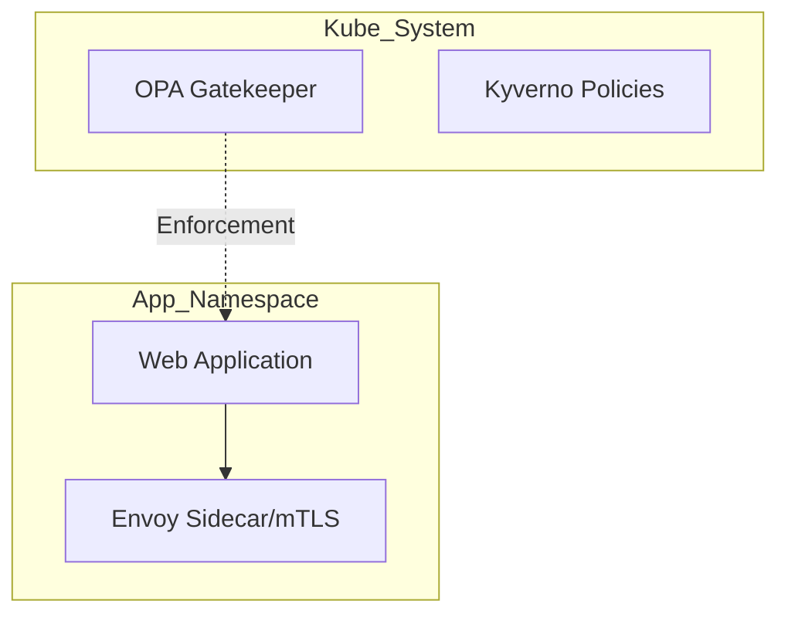

### 8. API Threat Detection Lifecycle
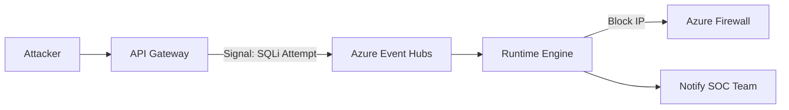

### 9. Multi-Tenant Role Model
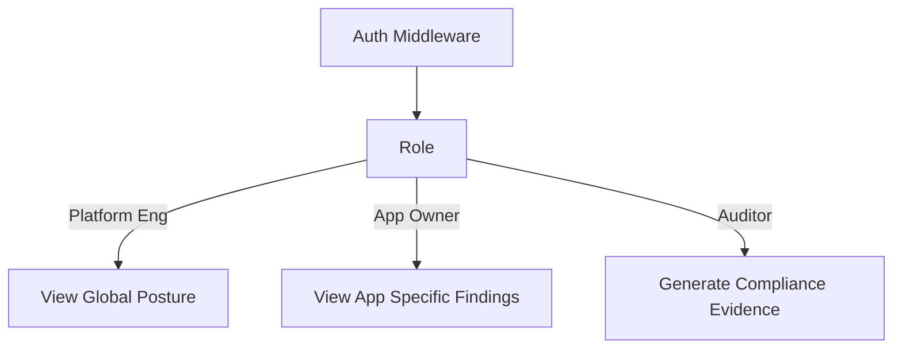

### 10. Continuous Monitoring Flow
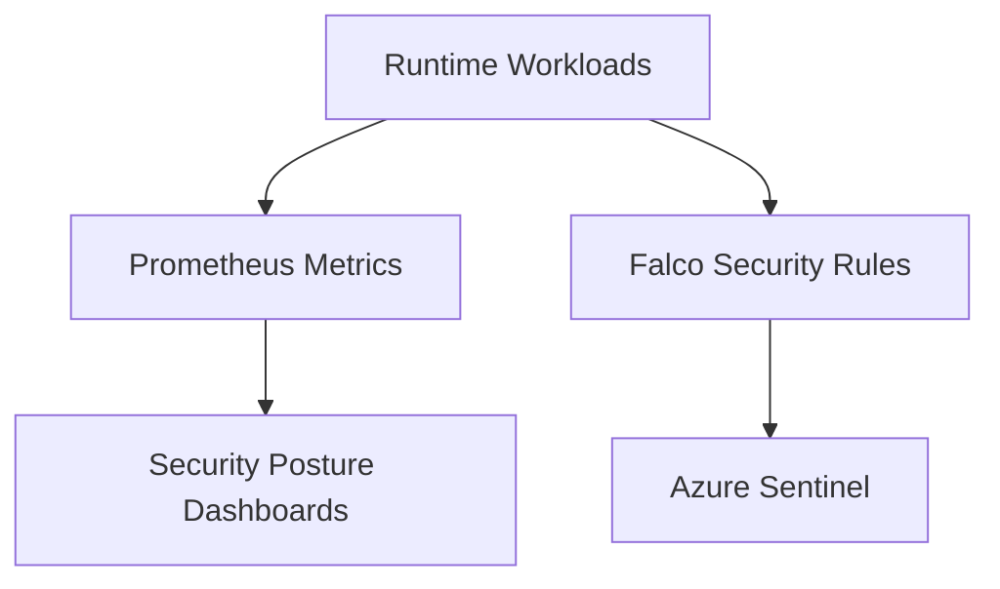

### 11. Findings Remediation Workflow
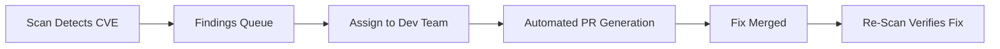

### 12. Disaster Recovery Security
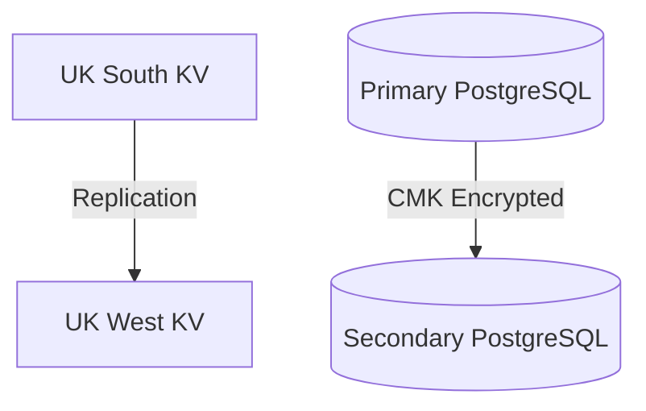

### 13. Policy Drift Detection
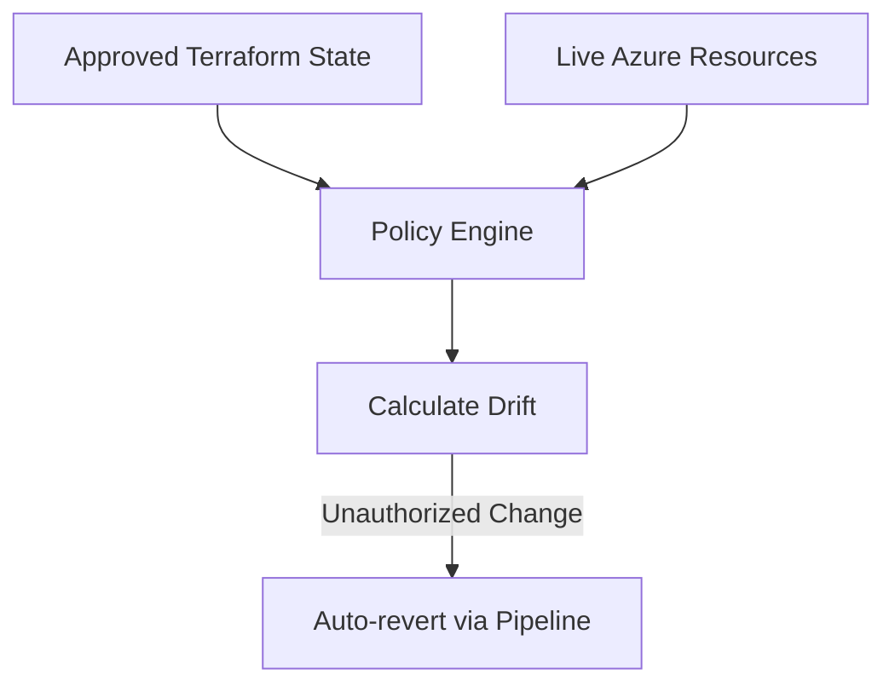

### 14. Supply Chain Security (SLSA)
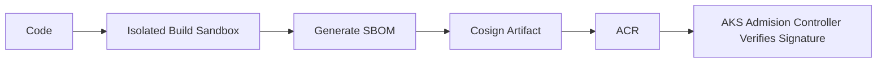

### 15. Executive Reporting Subsystem
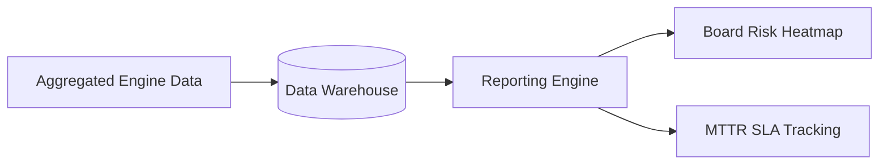

---

## 🛠️ Global Platform Components

| Engine | Directory | Purpose |
|:---|:---|:---|
| **Security Portal** | `apps/security-portal/` | The Next.js SOC / Developer interface for managing risk. |
| **Platform API** | `backend/src/` | Centralized router for ingestion of scan telemetry. |
| **Policy Engine** | `apps/policy-engine/`| OPA/Rego wrapper validating IaC and Kubernetes manifests. |
| **Scan Engine** | `apps/scan-engine/` | Orchestrates parallel SAST, DAST, and container scans. |
| **Compliance Engine** | `apps/compliance-engine/` | Normalizes technical CVEs into business compliance domains. |
| **Runtime Engine** | `apps/runtime-engine/` | Ingests behavioral anomalies to catch zero-day breaches. |

---

## 🚀 Infrastructure Rollout

```bash
cd terraform/environments/prod
terraform init
terraform apply -auto-approve
```

---
<sub>&copy; 2026 Devopstrio &mdash; Securing the Modern Enterprise.</sub>
